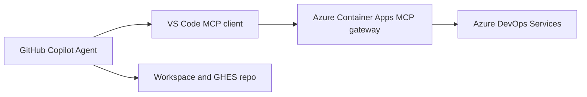

## Azure DevOps MCP Demo

This runbook maps to the live session agenda and uses the Azure Container Apps MCP gateway configured in `.vscode/mcp.json`. Keep the Docker assets in this repository as a separate local fallback.

## Objectives

1. Point VS Code at the Azure Container Apps MCP gateway through `.vscode/mcp.json`.
2. Authenticate with the gateway and validate access to your Azure DevOps organization.
3. Use GitHub Copilot in Agent mode to create and update Azure DevOps work items from natural language.

## Prerequisites

- VS Code or VS Code Insiders has GitHub Copilot and MCP support enabled.
- You have access to an Azure DevOps Services organization backed by Microsoft Entra ID.
- Your user account has permission to read project metadata and create or update work items.
- Your network allows outbound HTTPS access to `ado-mcp-gateway.yellowmeadow-a79e4e9c.westus2.azurecontainerapps.io`.
- Optional fallback only: Docker Desktop is installed and running, and you have an Azure DevOps PAT.
- Optional for agenda items 6 and 7: you have a GitHub Enterprise Server repo that Copilot can modify and push to.

> **Note:** The remote Azure DevOps MCP server requires an Azure DevOps Services organization backed by Microsoft Entra ID. Azure DevOps Server on-premises and standalone Microsoft account organizations are not supported by this remote flow.

## Architecture Overview



## Demo Assets

- [../.vscode/mcp.json](../.vscode/mcp.json)
- [./ado-mcp-hosting-options.md](./ado-mcp-hosting-options.md)
- [../mcp/azure-devops/Dockerfile](../mcp/azure-devops/Dockerfile)
- [../mcp/azure-devops/entrypoint.sh](../mcp/azure-devops/entrypoint.sh)
- [../mcp/azure-devops/.env.example](../mcp/azure-devops/.env.example)

## Session Flow

### 1. Why MCP, and what we're showing today

Use MCP to give Copilot a governed tool surface for Azure DevOps instead of relying on free-form UI navigation or hand-written REST calls.

### 2. Prerequisites and architecture overview

Show the architecture diagram above, then point out that the only Azure DevOps-specific component in the path is the Azure DevOps-hosted MCP endpoint.

### 3. Remote MCP setup

1. Open [../.vscode/mcp.json](../.vscode/mcp.json).
2. Confirm that the workspace points to `https://ado-mcp-gateway.yellowmeadow-a79e4e9c.westus2.azurecontainerapps.io/mcp`.
3. From the MCP view in VS Code, start `ado-remote-mcp`.
4. Complete the gateway authentication flow when prompted.
5. If the client cannot authenticate to the gateway, use the local Docker assets in `mcp/azure-devops` as a separate fallback.

### 4. Client configuration: pointing mcp.json at the hosted endpoint

Open [../.vscode/mcp.json](../.vscode/mcp.json). The workspace connects over HTTP to the Azure Container Apps gateway's `/mcp` endpoint.

- The gateway requires authentication; complete the sign-in flow when VS Code prompts.
- The configuration does not set a read-only header, so requested write operations can use the gateway's available write tools, subject to Azure DevOps permissions.

From the MCP view in VS Code, start `ado-remote-mcp`.

### 5. Demo, part 1: create work items in Azure DevOps from natural language

Start with a connectivity check:

```text
List my Azure DevOps organizations.
```

Then create a work item by naming the target organization and project:

```text
In Azure DevOps organization "contoso" and project "GitHub Migration", create a new user story titled "Demo traceability through MCP". Add a short description, three acceptance criteria, and return the work item ID.
```

If you want a bug instead:

```text
In Azure DevOps organization "contoso" and project "GitHub Migration", create a bug titled "GitHub Enterprise push flow needs validation". Set a concise repro, impact statement, and initial priority.
```

### 6. Demo, part 2: turn a work item into a code change and push to GitHub Enterprise Server

This step uses the work item as source context and the repository or GitHub tooling to perform the code change.

Example prompt:

```text
Use the work item we just created as the source of truth. Make the smallest change in this repository that satisfies it, summarize the diff, commit it on a new branch, and push it to GitHub Enterprise Server.
```

### 7. Demo, part 3: update the work item with the commit link

For GitHub Enterprise commits and pull requests, the simplest traceability loop is a work item comment with the resulting URL.

```text
Add a markdown comment to work item 12345 that links to https://ghe.example.com/org/repo/commit/<sha> and says the change is ready for review.
```

### 8. Security, scoping, and operational considerations

- The gateway handles authentication; do not add access tokens or PATs to the repository configuration.
- Make sure the Azure DevOps organization is backed by Microsoft Entra ID and that your user has the required project permissions.
- Network policy must allow outbound HTTPS traffic to `ado-mcp-gateway.yellowmeadow-a79e4e9c.westus2.azurecontainerapps.io`.
- Azure DevOps permissions still determine which operations the authenticated user can perform.
- Keep the local Docker setup only as a fallback for clients that cannot complete the remote authentication flow.

### 9. Q&A and next steps

Use [ado-mcp-hosting-options.md](./ado-mcp-hosting-options.md) as the take-away for other hosting models and client configurations. If you need a local fallback later, the Docker assets remain under `mcp/azure-devops`.